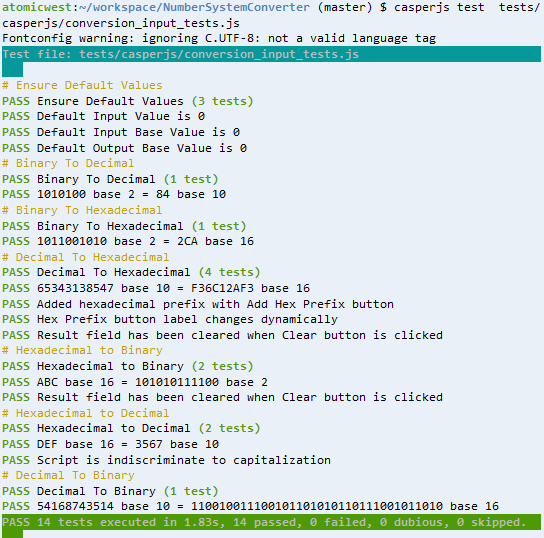

### [UI testing][mainUItest] 
* uses a CasperJS script that can be found in the tests folder. There are currently 14 basic tests, which can be run from the terminal on a machine that has PhantomJS and CasperJS installed. When everything is working, your terminal will look like this:




#### Run tests from the terminal with:
```bash
$ casperjs test NAME_OF_TEST.js
```
* CasperJS, PhantomJS, and Python >2.6 must be installed on your system
* Screenshots are currently enabled for the [headless browser test suite][mainUItest]
* [Unit tests][unit] have been created for core functions, currently 4 for checkBase(), 4 for fromDecimal(), and 4 for toDecimal()
 

[mainUItest]: /conversion_input_tests.js
[unit]: /unit_tests.js